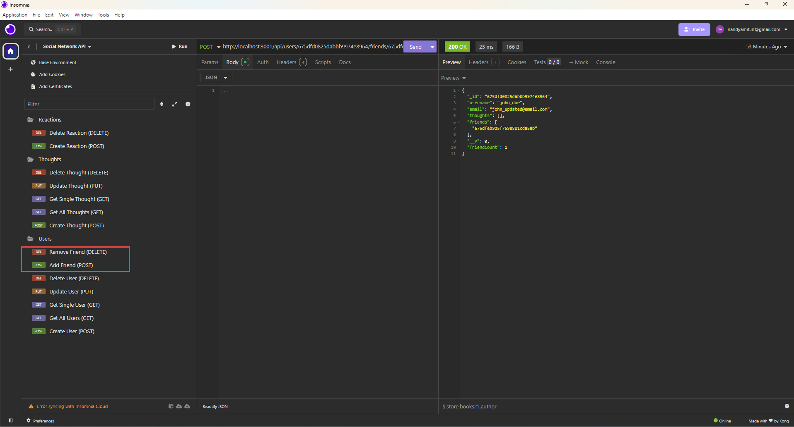

# Social Network API

## Table of Contents
- [Description](#description)
- [Features](#features)
- [Technologies Used](#technologies-used)
- [Installation](#installation)
- [Usage](#usage)
- [API Routes](#api-routes)
- [Screenshots](#screenshots)
- [Walkthrough Video](#walkthrough-video)
- [Contributing](#contributing)
- [License](#license)
- [Questions](#questions)

## Description
A REST API for a social network web application where users can share their thoughts, react to friends' thoughts, and create a friend list. This API uses Express.js for routing, a MongoDB database, and the Mongoose ODM.

## Features
- Create, read, update, and delete users and thoughts
- Create and delete reactions to thoughts
- Add and remove friends to a user's friend list
- Real-time data persistence using MongoDB

## Technologies Used
- Node.js
- Express.js
- MongoDB
- Mongoose ODM

## Installation
1. Clone the repository:
```bash
git clone https://github.com/yourusername/social-network-api.git
```

2. Navigate to the project directory:
```bash
cd social-network-api
```

3. Install dependencies:
```bash
npm install
```

4. Make sure MongoDB is installed and running on your machine

## Usage
1. Start the server:
```bash
npm start
```

2. The server will start running on `http://localhost:3001`

3. Use Insomnia or a similar tool to test the API routes

## API Routes

### User Routes
| HTTP Method | Endpoint | Description |
|------------|----------|-------------|
| GET | `/api/users` | Get all users |
| GET | `/api/users/:id` | Get user by ID |
| POST | `/api/users` | Create new user |
| PUT | `/api/users/:id` | Update user |
| DELETE | `/api/users/:id` | Delete user |

### Friend Routes
| HTTP Method | Endpoint | Description |
|------------|----------|-------------|
| POST | `/api/users/:userId/friends/:friendId` | Add friend |
| DELETE | `/api/users/:userId/friends/:friendId` | Remove friend |

### Thought Routes
| HTTP Method | Endpoint | Description |
|------------|----------|-------------|
| GET | `/api/thoughts` | Get all thoughts |
| GET | `/api/thoughts/:id` | Get thought by ID |
| POST | `/api/thoughts` | Create new thought |
| PUT | `/api/thoughts/:id` | Update thought |
| DELETE | `/api/thoughts/:id` | Delete thought |

### Reaction Routes
| HTTP Method | Endpoint | Description |
|------------|----------|-------------|
| POST | `/api/thoughts/:thoughtId/reactions` | Add reaction |
| DELETE | `/api/thoughts/:thoughtId/reactions/:reactionId` | Remove reaction |

## Screenshots

### User Routes


### Friend Routes


### Thought Routes


### Reaction Routes


## Walkthrough Video


## Contributing
1. Fork the repository
2. Create a new branch
3. Make your changes
4. Submit a pull request

## License
This project is licensed under the MIT License.

## Questions
If you have any questions about this project, please feel free to contact me:
- GitHub: [nandyamit](https://github.com/nandyamit)
